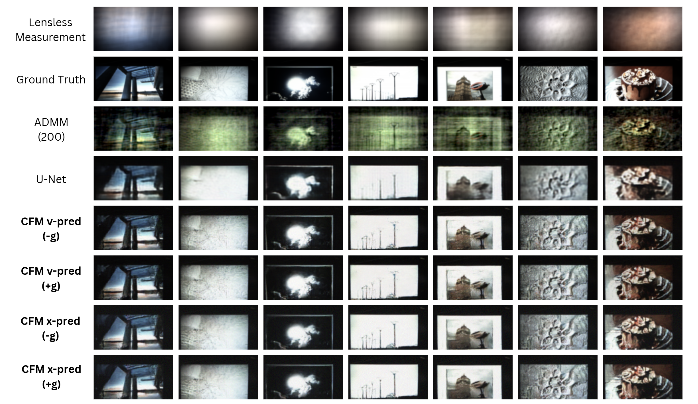
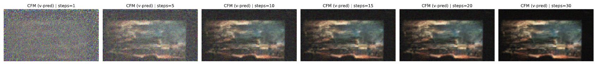

# Physics-Guided Conditional Flow Matching for Lensless Imaging





Final Project for EECS 298: Computational Optics, Winter 2026, UC Irvine.

This project trains a Conditional Flow Matching (CFM) model to map lensless measurements (y) to lensed images (x),
and uses physics-guided sampling with a known PSF forward model H to enforce data consistency.

Key pieces:
- CFM training: learn $v_\theta(t, x_t, y)$ where $x_t = (1-t)\epsilon + t x$
- Flow-matcher backends: choose between rectified flow (`cfm.matcher: rectified`) and OT-CFM (`cfm.matcher: ot_cfm`) via TorchCFM
- Sampling: integrate ODE with Euler steps + data-consistency gradient step using $H^T(Hx - y)$

Dataset:
- DiffuserCam MirFlickr (via LenslessPiCam HuggingFace loader)

Our contributions:
- We are the first to formulate lensless reconstruction as conditional generation with CFM and study its empirical advantages over optimization-based and supervised baselines.
- We compare two practical parameterizations, velocity prediction and image prediction with induced velocity.
- We analyze the inference-time trade-offs, including ODE step budget and the incremental effect of optional physics guidance.

**Report available** [here](https://github.com/Charley-xiao/lensless-flow/blob/master/public/EECS_298_Report.pdf).

**Presentation slides** available [here](https://github.com/Charley-xiao/lensless-flow/blob/master/public/EECS_298_Presentation.pdf).

## Install

### Locally

Install Python 3.12 first and then:

```bash
pip install -r requirements.txt
```

`requirements.txt` now includes [`torchcfm`](https://github.com/atong01/conditional-flow-matching), which provides the rectified-flow and OT-CFM matchers used by the training core.

### On a cluster

```bash
conda create -n py312 python=3.12 -y
conda activate py312
pip install torch torchvision --index-url https://download.pytorch.org/whl/cu130
pip install -r requirements.txt
export HF_ENDPOINT=https://hf-mirror.com
export HF_TOKEN=<...>
hf download bezzam/DiffuserCam-Lensless-Mirflickr-Dataset --repo-type dataset --local-dir <...>
# Then go to configs/a100_base.yaml and set data.path to the local path of the downloaded dataset,
# and set wandb.log_artifacts to false.
wandb login --relogin
wandb offline
```

## Train

```bash
python -m scripts.train --config configs/base.yaml
# On Google Colab, use the A100 config:
python -m scripts.train --config configs/a100_base.yaml
```

Switch between the default rectified-flow training objective and OT-CFM by editing:

```yaml
cfm:
  matcher: "rectified"  # or "ot_cfm"
```

## Sample / Visualize

```bash
python -m scripts.sample --config configs/base.yaml --ckpt checkpoints/cfm_lensless_vanilla_rectified_epoch10_ssim0.7000.pt --idx 0 --steps 5,10,20,30,50 --cols 4
python -m scripts.eval --config configs/base.yaml --ckpt ...
```

## Checkpoints

See [Releases](https://github.com/Charley-xiao/lensless-flow/releases)

## License

This repository is licensed under the GNU Affero General Public License v3.0
because `lensless_flow/data.py` includes and modifies code derived from the LenslessPiCam project.

Upstream project:
- LenslessPiCam — https://github.com/LCAV/LenslessPiCam

See `LICENSE` and `THIRD_PARTY_NOTICES.md` for details.
