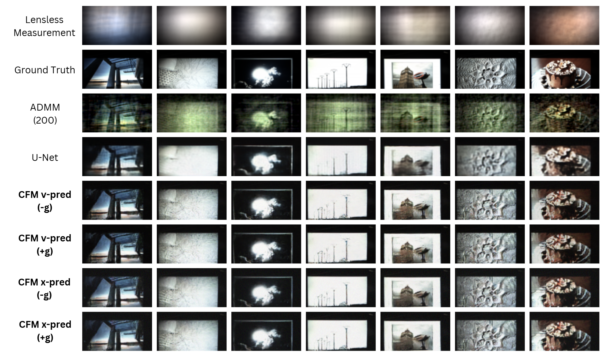
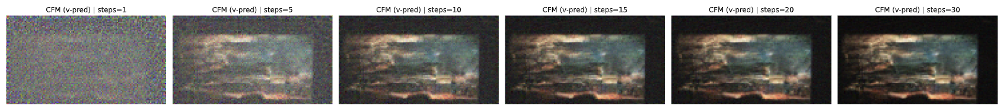
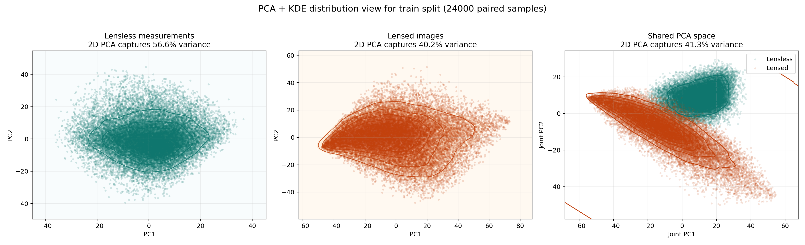

# Physics-Guided Conditional Flow Matching for Lensless Imaging







Final Project for EECS 298: Computational Optics, Winter 2026, UC Irvine.

This project trains a Conditional Flow Matching (CFM) model to map lensless measurements (y) to lensed images (x),
and uses physics-guided sampling with a known PSF forward model H to enforce data consistency.

Key pieces:
- CFM training: learn $v_\theta(t, x_t, y)$ where $x_t = (1-t)\epsilon + t x$
- Flow-matcher backends: choose between rectified flow (`cfm.matcher: rectified`) and OT-CFM (`cfm.matcher: ot_cfm`) via TorchCFM
- Sampling: integrate ODE with Euler steps + data-consistency gradient step using $H^T(Hx - y)$

Dataset:
- DiffuserCam MirFlickr (via LenslessPiCam HuggingFace loader)

Our contributions:
- We are the first to formulate lensless reconstruction as conditional generation with CFM and study its empirical advantages over optimization-based and supervised baselines.
- We compare two practical parameterizations, velocity prediction and image prediction with induced velocity.
- We analyze the inference-time trade-offs, including ODE step budget and the incremental effect of optional physics guidance.

**Report available** [here](https://github.com/Charley-xiao/lensless-flow/blob/master/public/EECS_298_Report.pdf).

**Presentation slides** available [here](https://github.com/Charley-xiao/lensless-flow/blob/master/public/EECS_298_Presentation.pdf).

## Install

### Locally

Install Python 3.12 first and then:

```bash
pip install -r requirements.txt
```

`requirements.txt` now includes [`torchcfm`](https://github.com/atong01/conditional-flow-matching), which provides the rectified-flow and OT-CFM matchers used by the training core.

### On a cluster

```bash
conda create -n py312 python=3.12 -y
conda activate py312
pip install torch torchvision --index-url https://download.pytorch.org/whl/cu130
pip install -r requirements.txt
export HF_ENDPOINT=https://hf-mirror.com
export HF_TOKEN=<...>
hf download bezzam/DiffuserCam-Lensless-Mirflickr-Dataset --repo-type dataset --local-dir <...>
# Then go to configs/a100_base.yaml and set data.path to the local path of the downloaded dataset,
# and set wandb.log_artifacts to false.
wandb login --relogin
wandb offline
```

## Train

```bash
python -m scripts.train --config configs/base.yaml
# On Google Colab, use the A100 config:
python -m scripts.train --config configs/a100_base.yaml
```

Any script that takes `--config` also accepts OmegaConf-style CLI overrides, so you can tweak nested fields without editing YAML files:

```bash
python -m scripts.train --config configs/a100_base.yaml train.batch_size=16 model.base_channels=48 wandb.enabled=false
python -m scripts.sample --config configs/base.yaml --ckpt checkpoints/your_model.pt --steps 20,40 physics.dc_steps=2
python -m scripts.eval --config configs/base.yaml --ckpt checkpoints/your_model.pt sample.steps=30
```

## Human RBC Hologram Reconstruction

The RBC config trains pure conditional flow matching from a hologram image to
its paired phase map. It does not use a PSF or data-consistency guidance.
Validation uses fixed latent seeds by default; otherwise pure-flow sampling
resamples a different Gaussian start every epoch and the SSIM curve is too
noisy to compare checkpoints fairly.

Expected local dataset layout:

```text
E:/RBCs Holograms/
  Holograms/Training/*.png
  Holograms/Validation/*.png
  Phase/Training/*.png
  Phase/Validation/*.png
```

Run with the project environment:

```bash
conda activate py312
python -m scripts.train --config configs/rbc_hologram.yaml
python -m scripts.sample --config configs/rbc_hologram.yaml --ckpt checkpoints/your_rbc_checkpoint.pt --idx 0 --steps 10,20,40
python -m scripts.infer_rbc --config configs/rbc_hologram.yaml --ckpt checkpoints/your_rbc_checkpoint.pt --max_samples 64 --save_inputs --save_targets
python -m scripts.eval --config configs/rbc_hologram.yaml --ckpt checkpoints/your_rbc_checkpoint.pt --flow_only --max_batches 200 --seed 20260903
```

For a larger 256x256 RBC run, use `configs/rbc_hologram_unet64.yaml`
(width 64, four U-Net scales, about 69.5M parameters). The even larger
`configs/rbc_hologram_large_unet.yaml` uses five scales and about 110.7M
parameters.

For scripts that already expose a dedicated flag such as `--steps`, that explicit flag still takes precedence over the config value.

The default training configs now use a compact `nafnet`-style backbone:
- restoration-oriented local NAF blocks for strong low-level image priors
- no quadratic-attention bottleneck, so training memory stays much more predictable at full resolution
- the older `unet`, `hybridformer`, and `sit` backbones remain available through `model.name`

Switch between the default rectified-flow training objective and OT-CFM by editing:

```yaml
cfm:
  matcher: "rectified"  # or "ot_cfm"
```

Init from $H^T(y)$:

```yaml
cfm:
  matcher: "rectified" # "rectified" or "ot_cfm"
  t_min: 0.001
  t_max: 0.999
  sigma_data: 1.0  # used for normalization choices (optional)
  source:
    mode: "measurement_initialized"  # "gaussian" or "measurement_initialized"
    init: "adjoint"                  # P(y,H): normalized H^T y
    normalize: "max"
    sigma0: 1.0
  loss:
    v_weight: 1.0
    physics_weight: 0.0   # set 0 to disable physics loss during training
```

Init from ADMM:

```yaml
cfm:
  matcher: "rectified" # "rectified" or "ot_cfm"
  t_min: 0.001
  t_max: 0.999
  sigma_data: 1.0  # used for normalization choices (optional)
  source:
    mode: "measurement_initialized"  # "gaussian" or "measurement_initialized"
    init: "admm"                     # P(y,H): coarse constrained ADMM initializer
    normalize: "clamp"
    sigma0: 1.0
    admm:
      steps: 100
      inner_steps: 1
      rho: 0.1
      step_size: 0.001
      start: "adjoint"
      start_normalize: "max"
  loss:
    v_weight: 1.0
    physics_weight: 0.0   # set 0 to disable physics loss during training
```

## One-step distillation

The strongest full model can be too slow at inference because a 40-step Heun sampler uses roughly 80 U-Net evaluations per reconstruction. The distillation pipeline trains a student that keeps the same conditional v-prediction interface but is evaluated with one Euler step:

```python
z0 ~ N(0, sigma0)
v_student = student(z0, y, t=0)
x_hat = z0 + v_student
```

This is true 1-NFE generation when evaluated with `sample.steps=1` and `sample.solver=euler`.

### Why train in two phases?

The two `train_distill` runs are recommended, not mathematically required.

The first run, `--phase reflow`, teaches the student the whole teacher-induced straight-line flow. For each cached teacher pair `(z0, x_teacher)`, it samples random times and trains on:

```python
x_t = (1 - t) * z0 + t * x_teacher
v_target = x_teacher - z0
```

This is easier than immediately forcing the model to be perfect at only `t=0`, and it makes the vector field more self-consistent across the path.

The second run, `--phase one_step`, fine-tunes exactly the deployment case:

```python
t = 0
x_1step = z0 + student(z0, y, 0)
```

This removes the train-test mismatch left by reflow training. In practice, `reflow -> one_step` is usually more stable than direct one-step training. If you need a faster experiment, you can skip the first run and train with `--phase one_step`, or use `--phase mixed` to combine random-time reflow samples and `t=0` samples in one run.

### 1. Cache teacher outputs

Use the frozen 40-step teacher to generate distillation targets. The cache stores sharded tensors containing `(y, x_gt, z0, x_teacher)` plus metadata. For the current best Gaussian-source v-prediction teacher, keep `--source_mode gaussian`.

```bash
python -m scripts.cache_teacher_distill \
  --config configs/distill_1step.yaml \
  --teacher_ckpt checkpoints/v_xl.pt \
  --out_dir outputs/distill_cache/v_xl_gaussian \
  --teacher_steps 40 \
  --teacher_solver heun \
  --source_mode gaussian \
  --batch_size 1 \
  --num_workers 0 \
  --shard_size 128 \
  --save_dtype float16 \
  --overwrite
```

Useful cache options:

- `--max_samples 128` for a quick subset smoke test.
- `--seeds_per_sample 2` or higher to cache multiple Gaussian draws per measurement.
- `--teacher_steps` and `--teacher_solver` should match the teacher you want to imitate.
- `--overwrite` is required when replacing an existing cache directory.
- If Hugging Face is already cached locally, offline mode can avoid metadata/network failures:

```bash
export HF_HUB_OFFLINE=1
export HF_DATASETS_OFFLINE=1
```

On Windows PowerShell, use:

```powershell
$env:HF_HUB_OFFLINE='1'
$env:HF_DATASETS_OFFLINE='1'
```

### 2. Reflow distillation

Initialize the student from the teacher checkpoint and train on random intermediate times along the cached teacher path:

```bash
python -m scripts.train_distill \
  --config configs/distill_1step.yaml \
  --cache_dir outputs/distill_cache/v_xl_gaussian \
  --init_ckpt checkpoints/v_xl.pt \
  --out_dir outputs/distill_1step/reflow \
  --phase reflow
```

The main losses are:

```python
MSE(v_student, x_teacher - z0)
+ teacher_l1_weight * L1(x_endpoint, x_teacher)
+ gt_l1_weight * L1(x_endpoint, x_gt)
+ physics_weight * ||H x_endpoint - y||^2
```

The default `configs/distill_1step.yaml` keeps the physics loss off. Turn it on with a small value only after the basic student is learning:

```bash
python -m scripts.train_distill \
  --config configs/distill_1step.yaml \
  --cache_dir outputs/distill_cache/v_xl_gaussian \
  --init_ckpt checkpoints/v_xl.pt \
  --out_dir outputs/distill_1step/reflow_phys \
  --phase reflow \
  distill.physics_weight=0.001
```

### 3. One-step fine-tuning

Fine-tune from the best reflow checkpoint using only `t=0`, which matches one-step Euler inference:

```bash
python -m scripts.train_distill \
  --config configs/distill_1step.yaml \
  --cache_dir outputs/distill_cache/v_xl_gaussian \
  --init_ckpt outputs/distill_1step/reflow/distill_1step_best.pt \
  --out_dir outputs/distill_1step/one_step \
  --phase one_step
```

The output directory contains:

- `distill_1step_best.pt`: best checkpoint by cached eval PSNR.
- `distill_1step_latest.pt`: latest checkpoint.
- `distill_1step_epoch*.pt`: periodic checkpoints.

### 4. Evaluate true one-step generation

Use `configs/distill_1step.yaml`, `--flow_only`, and Euler:

```bash
python -m scripts.eval \
  --config configs/distill_1step.yaml \
  --ckpt outputs/distill_1step/one_step/distill_1step_best.pt \
  --flow_only \
  --solver euler
```

The eval summary should show:

```text
steps: 1
solver: euler
```

This avoids Heun's second model call and prevents the default baseline U-Net from being loaded.

## Physical robustness evaluation

Physical robustness is evaluated one model at a time. Each run takes one checkpoint, applies the requested measurement or PSF corruptions, and writes a result file for that model. This keeps long evaluations resumable and makes it easy to add or replace baselines without rerunning everything.

Velocity-prediction flow:

```bash
python -m scripts.eval_physical_robustness \
  --config configs/a100_base.yaml \
  --ckpt checkpoints/v_xl.pt \
  --method v_prediction \
  --result_name v_prediction \
  --label "v-prediction" \
  --out_dir outputs/physical_robustness
```

Image-prediction flow:

```bash
python -m scripts.eval_physical_robustness \
  --config configs/a100_base.yaml \
  --ckpt checkpoints/x_xl \
  --method x_prediction \
  --result_name x_prediction \
  --label "x-prediction" \
  --out_dir outputs/physical_robustness
```

Baseline U-Net:

```bash
python -m scripts.eval_physical_robustness \
  --config configs/a100_base.yaml \
  --ckpt checkpoints/unet.pt \
  --method unet \
  --unet_config configs/unet_baseline.yaml \
  --result_name unet \
  --label "baseline U-Net" \
  --out_dir outputs/physical_robustness
```

Distilled one-step flow:

```bash
python -m scripts.eval_physical_robustness \
  --config configs/distill_1step.yaml \
  --ckpt outputs/distill_1step/one_step/distill_1step_best.pt \
  --method v_prediction \
  --result_name distill_1step \
  --label "1-step distilled" \
  --steps 1 \
  --solver euler \
  --out_dir outputs/physical_robustness
```

Each run writes:

```text
<result_name>_physical_robustness_summary.csv
<result_name>_physical_robustness_per_sample.csv
<result_name>_physical_robustness_metadata.json
```

Useful options:

- `--max_samples 32` for a quick smoke test.
- `--corruptions background_offset,measurement_noise` to restrict the corruption set.
- `--measurement_noise_levels 0.0,0.01,0.02,0.05` to change severity levels.
- `--flow_disable_physics` or `--no-flow_disable_physics` to override physics guidance for flow methods.
- `--result_name` prevents overwriting when you evaluate multiple checkpoints with the same `--method`.

After the individual result files are present, plot everything in the directory:

```bash
python rqs/plot_physical_robustness_results.py \
  --results_dir outputs/physical_robustness \
  --out_dir outputs/paper/physical_robustness
```

By default, the plotting script uses `--methods auto` and discovers every file matching:

```text
*_physical_robustness_summary.csv
```

To plot a specific subset and fail if any requested file is missing:

```bash
python rqs/plot_physical_robustness_results.py \
  --results_dir outputs/physical_robustness \
  --methods v_prediction,x_prediction,unet,distill_1step \
  --out_dir outputs/paper/physical_robustness
```

Other baselines can be included in the plot as long as they write the same summary CSV columns and use the same filename pattern.

## Sample / Visualize

```bash
python -m scripts.sample --config configs/base.yaml --ckpt checkpoints/cfm_lensless_vanilla_rectified_epoch10_ssim0.7000.pt --idx 0 --steps 5,10,20,30,50 --cols 4
python -m scripts.eval --config configs/base.yaml --ckpt ...
python -m scripts.visualize_distribution --config configs/base.yaml --split train --max_samples 1000
python -m scripts.eval_upsampling --ckpt checkpoints/vanilla.pt --batch_size 8
```

## Checkpoints

See [Releases](https://github.com/Charley-xiao/lensless-flow/releases)

## License

This repository is licensed under the GNU Affero General Public License v3.0
because `lensless_flow/data.py` includes and modifies code derived from the LenslessPiCam project.

Upstream project:
- LenslessPiCam — https://github.com/LCAV/LenslessPiCam

See `LICENSE` and `THIRD_PARTY_NOTICES.md` for details.
